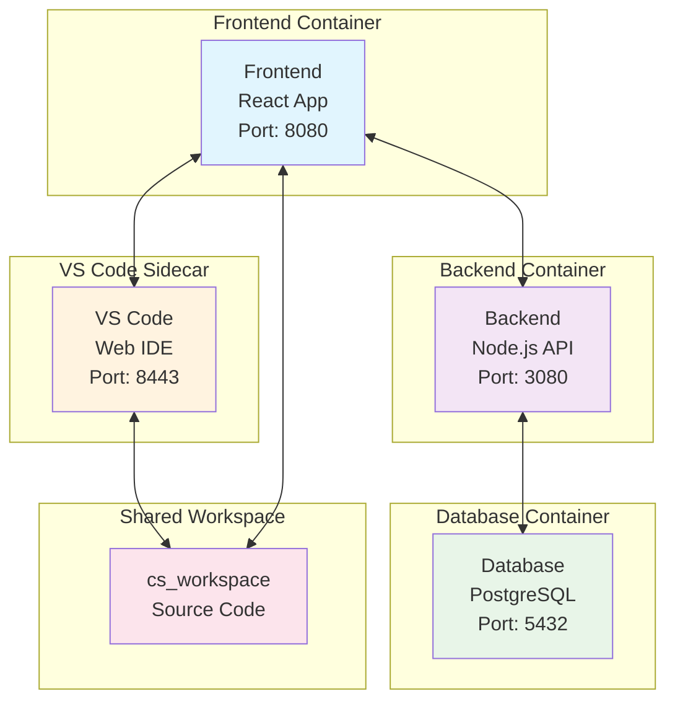
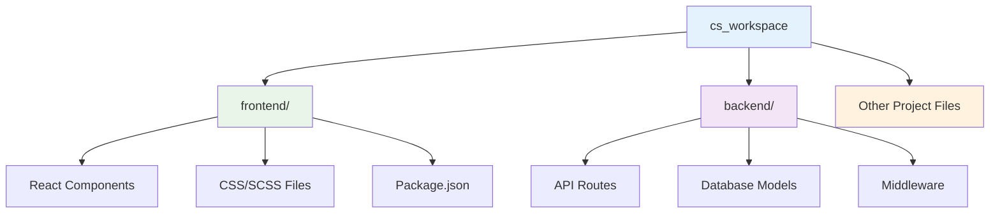

# VS Code Sidecar Integration with Bunnyshell

This template demonstrates how to integrate VS Code as a sidecar container for remote development using Bunnyshell. It provides a complete development environment with a full-stack application (frontend, backend, database) and VS Code accessible through a web browser.

## 🚀 Quick Start

1. **Deploy the template** using Bunnyshell
2. **Access your application** at `frontend-{your-domain}` and `backend-{your-domain}`
3. **Open VS Code** at `code-server-{your-domain}` with the password: `password`

## 📋 What's Included

This template provides:
- **Frontend Application**: React-based web application
- **Backend API**: Node.js backend service
- **Database**: PostgreSQL database
- **VS Code**: Web-based IDE accessible from anywhere
- **Shared Workspace**: Code accessible from both the main app and VS Code

## 🏗️ Architecture Overview



## ⚙️ Configuration

### Template Variables

| Variable | Description | Default | Required |
|----------|-------------|---------|----------|
| `PASSWORD` | VS Code web interface password | `password` | Yes |
| `HASHED_PASSWORD` | Hashed version of password (optional) | `` | No |
| `PUID` | User ID for container permissions | `0` | No |
| `PGID` | Group ID for container permissions | `0` | No |
| `SUDO_PASSWORD` | Sudo password for container | `password` | No |
| `SUDO_PASSWORD_HASH` | Hashed sudo password (optional) | `` | No |
| `PROXY_DOMAIN` | Custom proxy domain (optional) | `` | No |
| `TZ` | Timezone setting | `Etc/UTC` | No |

### Port Configuration

- **Frontend**: `8080` (main application)
- **Backend**: `3080` (API service)
- **Database**: `5432` (PostgreSQL)
- **VS Code**: `8443` (web IDE)

## 🔧 Key Configuration Sections

### 1. Sidecar Container Definition

```yaml
pod:
  sidecar_containers:
    - from: code-server
      name: sidecar-code-server
      shared_paths:
        - path: /cs_workspace
          target:
            path: /usr/src/app
            container: '@parent'
          initial_contents: '@target'
```

**What this does:**
- Creates a VS Code sidecar container
- Shares the `/cs_workspace` directory between containers
- Maps to `/usr/src/app` in the main application container
- Initializes with the target container's contents

### 2. Port Exposure

```yaml
ports:
  - '8080:8080'  # Frontend app
  - '8443:8443'  # VS Code sidecar
```

**Important:** Both ports must be exposed on the main application to make the sidecar accessible.

### 3. VS Code Container Configuration

```yaml
kind: SidecarContainer
name: code-server
dockerCompose:
  image: 'lscr.io/linuxserver/code-server:latest'
  environment:
    DEFAULT_WORKSPACE: /cs_workspace
    PASSWORD: '{{template.vars.PASSWORD}}'
    # ... other environment variables
  ports:
    - '8443:8443'
```

## 🔐 Security Considerations

### Default Credentials
- **VS Code Password**: `password` (change this in production!)
- **Database Password**: `need-to-replace` (must be changed!)

### Permission Management
When using custom UID/GID:
1. Set appropriate `PUID` and `PGID` values
2. Ensure consistency across containers
3. Use `id your_user` command to find your user/group IDs

## 📁 File Structure



## 🚀 Usage Workflow

```mermaid
flowchart TD
    A[Deploy Environment<br/>using Bunnyshell] --> B[Environment Ready]
    B --> C[Access VS Code<br/>code-server-{domain}]
    C --> D[Login with Password]
    D --> E[VS Code Interface Loaded]
    E --> F[Open Shared Workspace]
    F --> G[Start Coding]
    G --> H[Changes Auto-Sync<br/>Between Containers]
    
    style A fill:#e8f5e8
    style B fill:#e3f2fd
    style C fill:#fff3e0
    style D fill:#f3e5f5
    style E fill:#e1f5fe
    style F fill:#e8f5e8
    style G fill:#fff3e0
    style H fill:#e8f5e8
```

## 🔍 Troubleshooting

### Common Issues

**Permission Errors:**
- Ensure `PUID` and `PGID` match your user/group IDs
- Check that shared paths have correct permissions

**VS Code Not Accessible:**
- Verify port `8443` is exposed on the main application
- Check that the sidecar container is running
- Ensure hostname configuration is correct

**Workspace Not Syncing:**
- Verify `shared_paths` configuration
- Check that `initial_contents: '@target'` is set
- Ensure both containers can access the shared volume

### Debug Commands

```bash
# Check container status
docker ps

# View container logs
docker logs <container_name>

# Check shared volume contents
docker exec -it <container_name> ls -la /cs_workspace
```

## 📚 Additional Resources

- [Code-Server Environment Variables](https://docs.linuxserver.io/images/docker-code-server/#environment-variables-from-files-docker-secrets)
- [Bunnyshell Documentation](https://docs.bunnyshell.com/)

## 🤝 Contributing

This template is part of the Bunnyshell template collection. Feel free to:
- Report issues
- Suggest improvements
- Submit pull requests

## 📄 License

This template is provided as-is for educational and development purposes.